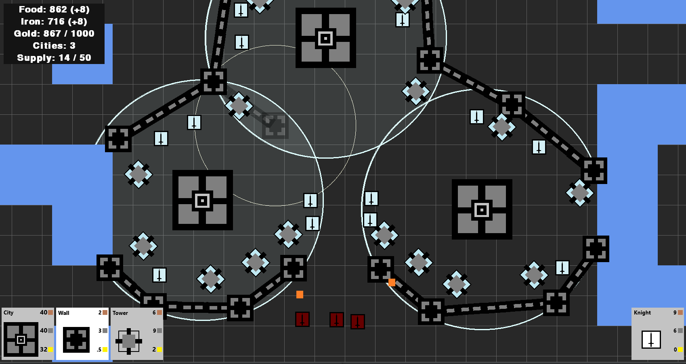
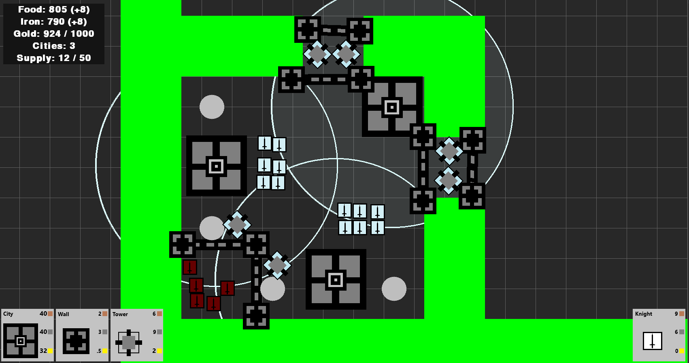
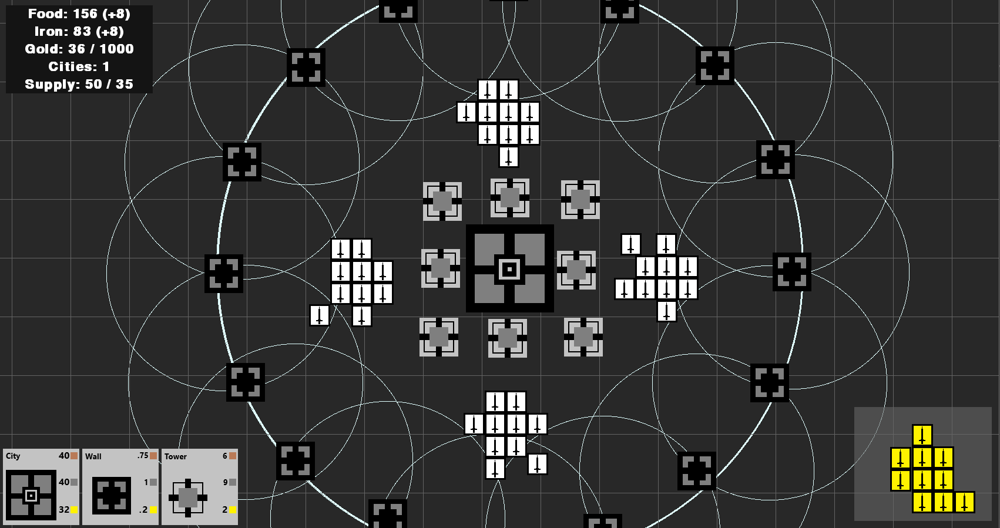
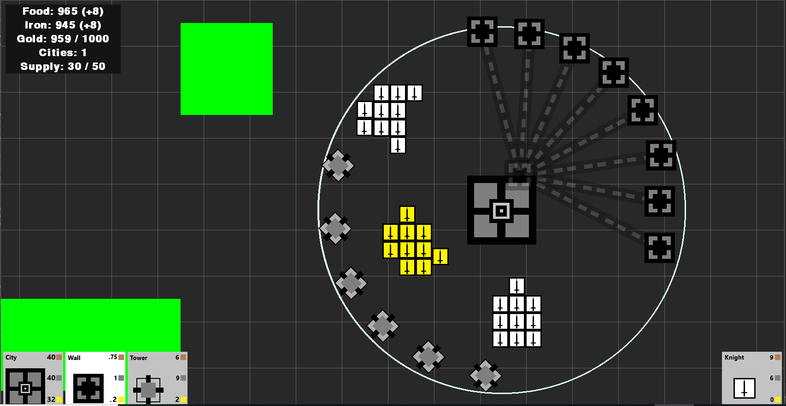

# Python RTS
In this project, I write code in python to build an RTS game. This is a personal project.

Below are some screen shots. Requires Python 3.6 and the Pygame modules to run.

## Snapshot 1

	</img>

## Snapshot 2

	</img>

## Snapshot 3

	</img>

## Snapshot 4

	</img>

