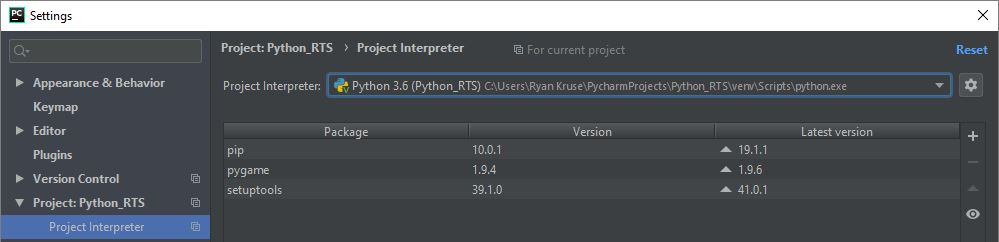
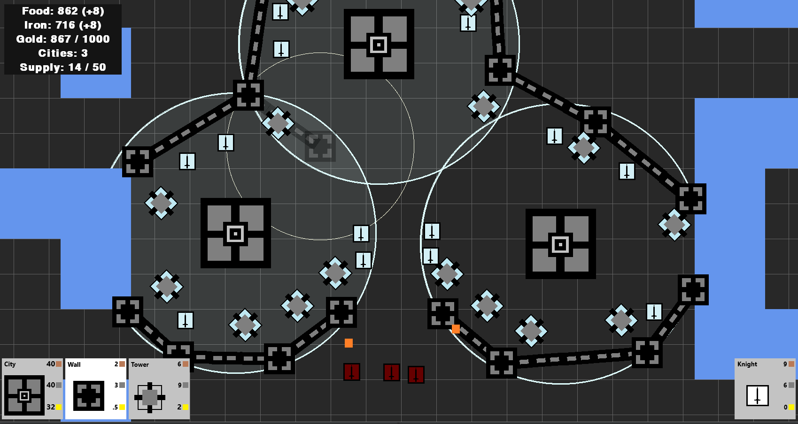
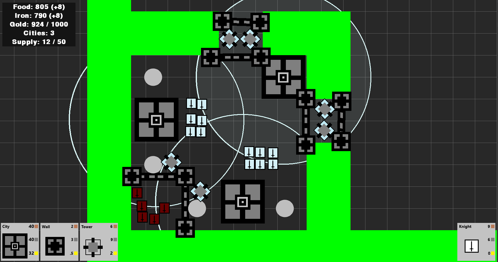
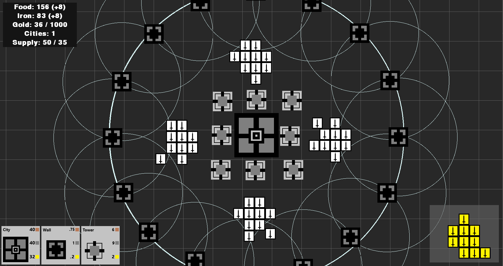
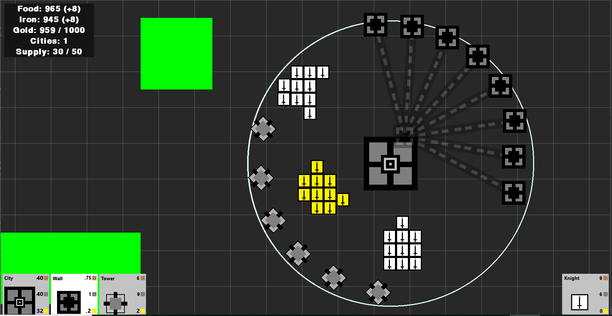

# Python RTS
In this project, I write code in python to build an RTS game. This is a personal project that I had a lot of fun programming in.
It sharpened me as a programmer and improved my abilities in OOP programming, data structure assembly, and algorithm optimization.

Inspired by Google Deepmind's victory over professional Starcraft II players, the main goal of this program is to eventually test different artificial intelligence algorithms.
If an AI can train itself in this model, then I think that would be really cool to understand which algorithms work best.

This program was developed in the PyCharm IDE. To run this program simply pull it from github and ensure that Python 3.6
and the Pygame modules are installed as the project interpreter.

	</img>

Below are some snaps shots of Python RTS.

## Snapshot 1

	</img>

## Snapshot 2

	</img>

## Snapshot 3

	</img>

## Snapshot 4

	</img>

